# Human in the loop is not enough: The Persistent and Evolving Limits of Human Oversight in High-Stakes AI

**Copyright © 2025 [Ankur Vatsa](ankur.vatsa@gmail.com). All rights reserved.**

*This work is protected by copyright. No part of this publication may be reproduced, distributed, or transmitted in any form or by any means, including photocopying, recording, or other electronic or mechanical methods, without the prior written permission of the author, except in the case of brief quotations embodied in critical reviews and certain other noncommercial uses permitted by copyright law.*

## Abstract

Artificial intelligence systems are now central to many high-stakes fields—regulation, healthcare, driverless vehicles, and scientific publishing. The common safety net is the "human in the loop" (HITL) paradigm, where humans are meant to act as a final check on AI decisions. However, growing evidence shows that in complex, high-speed, or high-volume situations, HITL is often not enough. 

This paper challenges the belief that simply adding HITL ensures accuracy, safety, or compliance in settings like regulatory interpretation, legal compliance, and financial reporting. The central thesis or main message of the paper is that HITL can't be your only safeguard. It should be one piece of a much larger, layered defense. HITL must be treated as one component in a layered defense strategy, not as a comprehensive safeguard.

To address these challenges, the paper discusses a range of layered safeguards and technical solutions—including automated controls, discriminator agents, ensemble model validation, benchmarking, and continuous monitoring—to strengthen oversight and reliability in high-stakes AI deployments. The importance of establishing measurable outcomes and implementing continuous monitoring is emphasized, ensuring that AI systems are not only robust at deployment but remain reliable and auditable over time.

The paper identifies evolving limitations of HITL oversight as commonly implemented, HITL is inadequate defense against LLM failure modes. Instead, organizations must invest in layered safeguards, structured validation pipelines, and AI-specific governance mechanisms that go beyond informal human oversight.

## 1. Introduction

Unprecedented integration of contemporary AI systems into crucial decision-making processes in scientific research, healthcare, finance, and transportation is being accomplished. The current risk-management strategy mainly depends on human oversight, known as Human-in-the-Loop (HITL)—a governance model where humans review, correct, or approve AI-generated outputs before they impact real-world decisions. This approach assumes that qualified experts can accurately spot and fix AI mistakes before they become dangerous.

However, research indicates that because of [automation bias](https://dx.plos.org/10.1371/journal.pone.0298037), cognitive overload, and the sheer volume of contemporary AI deployments, human reviewers usually miss AI mistakes. [According to recent studies](https://arxiv.org/abs/2405.10706), HITL systems frequently result in lower overall accuracy when compared to carefully thought-out automated safeguards due to the following broad reasons:
- **LLMs Are Prone to Hallucination:** Despite task-specific prompting and structured chaining, large language models frequently hallucinate fields, attributes, or compliance requirements - sometimes introducing entirely fictitious data elements that do not exist in either the older or newer regulatory versions.
- **HITL Is Not Measurable or Reliable:** Human-in-the-loop reviews are frequently marketed as safety precautions, but in practice, they are rarely auditable, trackable, or reliably reliable. Particularly when reviewing on a large scale, reviewers are frequently influenced by well-presented outputs, succumb to automation biases, and lack the time or expertise to detect minute legal or regulatory changes.
- **Structured Output ≠ Reliability:** Merely displaying extracted data in tables, JSON, or key-value pairs does not reduce risk. Even when the information is inaccurate or lacking, these neat and well-structured layouts can give the impression that it is trustworthy and accurate, creating a false sense of confidence.

There may be serious repercussions when HITL systems malfunction, including lost revenue in the billions, patient safety issues, legal infractions, eroded public confidence, etc. Due to overworked staff failing to recognise the biased flags generated by the algorithm, 10,000 families were wrongfully forced to repay large sums of money in the [Dutch childcare fraud scandal](https://www.reuters.com/world/europe/dutch-scandal-serves-warning-about-risks-algorithm-use-2021-02-10/), where hundreds of cases were processed daily without a thorough review.

This study scrutinises the shortcomings of HITL in various industries, pinpoints recurring failure patterns, and discusses potential solutions to prevent these issues. Organisations must view human oversight as a component of a larger, multi-layered strategy that includes automated controls, intelligent process design, and apparent organisational accountability if they want AI to be genuinely reliable in high-stakes situations.

### Objectives and Concrete Contributions
This paper gives actionable guidance for assessing and improving oversight of high‑stakes AI to practitioners, technical leads, and policymakers.

- Recognize and classify common HITL failure modes (speed mismatch, scale mismatch, overtrust, skill erosion, coordination gaps) and map them to domain examples.  
- Evaluate whether HITL is sufficient for a given use case and decide which additional safeguards are required (e.g., discriminator agents, circuit breakers, ensemble validation).  
- Apply concrete technical and process controls: design discriminator agents, implement benchmarking and continuous monitoring, define alerting thresholds, and construct audit‑trail logging schemas.  
- Prioritize remediation steps using a risk‑based framework that balances impact, operational cost, and urgency (what to implement first in production).  
- Use practical artifacts provided in the appendices (checklists, schema examples, benchmark references, red‑team templates) to operationalize recommendations and demonstrate compliance to stakeholders and regulators.

These contributions are supported by cross‑domain analyses, case studies, and concrete metrics presented in later sections to enable informed decision‑making and measurable improvements in AI oversight.


## 2. Critical Analysis of HITL Failures Across Domains
To unify the analysis across domains, we introduce a short taxonomy of HITL failure modes based on recurring patterns observed in high-stakes AI deployments:

- **Speed Mismatch**: Human reaction times (seconds to minutes) cannot keep pace with AI operations occurring in microseconds or milliseconds, as seen in algorithmic trading or autonomous vehicles.
- **Scale Mismatch**: The volume of AI outputs (e.g., thousands of alerts or data extractions) overwhelms human reviewers, leading to incomplete checks, as in AML monitoring or regulatory parsing.
- **Overtrust**: Automation bias causes humans to over-rely on AI outputs, especially when presented confidently, resulting in missed errors, as in healthcare diagnostics or financial compliance.
- **Skill Erosion**: Prolonged reliance on AI reduces human expertise and vigilance, creating "out-of-the-loop" problems where reviewers fail to intervene effectively, as in ADAS systems.
- **Coordination Gaps**: Misalignment between human and AI roles, such as unclear handover protocols or lack of training, leads to failures in mode confusion or escalation, as in social services fraud detection.

This taxonomy highlights systemic issues that transcend individual domains, providing a framework for understanding why HITL often falls short.
### 2.1 Financial Services: Regulatory Compliance and Risk Management

**Regulatory Document Processing** (*Status: ACTIVE RISK - Partially Remediated*)

With regulations like EMIR, MiFID, SFTR, and CFTC, financial institutions are increasingly turning to AI to automate the extraction and comparison of [swap reporting rules](https://www.cftc.gov/MarketReports/SwapsReports/index.htm). These AI tools can compare regulatory requirements - such as data types, validity checks, and mandatory fields - pull out details from swap trade reports, track changes across versions of regulatory documents, and generate clear summaries showing what's changed over time.

These systems can significantly reduce manual work. However, they also introduce serious risks that can immediately affect daily operations, compliance, and an organisation's reputation. In these scenarios, simply depending on human oversight is not enough to keep things safe or accurate.

- **False Confidence**: Well-formatted JSON output can easily provide reviewers the impression that everything is accurate, which only adds to the tendency to trust the system too much.
- **Scale Challenge**: Human reviewers simply can't keep up with the task of checking hundreds of extracted fields against complex, densely written regulations. 
- **Explainability and Audit Trails**: In financial compliance, it is critical that AI decisions are transparent and traceable. Explainable AI models and comprehensive audit trails enable organizations to justify automated decisions to regulators, support investigations, and ensure accountability for compliance outcomes.
- **Hallucination Risk**: LLMs can sometimes make up field requirements that don't actually exist or misunderstand rules that only apply in certain situations. 
- **Compliance Impact**: Failure to complete required fields may result in [fines exceeding $50M](https://www.cftc.gov/PressRoom/PressReleases/8380-20) for insufficient reporting of swap data.

**Current Remediation:** While a few organizations have started using ensemble model validation, most still rely heavily on human reviewers who are already stretched thin. To truly ensure accuracy before deploying these systems, it’s important to add stronger safeguards—like anomaly detection, independent checks, and combining multiple models for cross-validation.

**Algorithmic Trading Systems** (*Status: SUBSTANTIALLY REMEDIATED*)

The [Knight Capital flash crash (2012)](https://www.sec.gov/news/studies/2010/marketevents-report.pdf) made it clear that humans simply can’t react fast enough when trading happens in microseconds. The $460 million loss happened so quickly that no one could have spotted, let alone stopped, the problem in real time.

How was it remediated: Firms responded by putting automated circuit breakers, pre-trade risk checks, and automatic trading pauses in place to catch problems before they spiral. Now, humans focus on reviewing trades after the fact, rather than trying to intervene as things unfold.

**Anti-Money Laundering (AML) Monitoring** (*Status: ACTIVE RISK - Poorly Remediated*)

Banks face a flood of AML alerts every day, with false positive rates often topping 95%. [Recent studies by Morrison et al.](https://doi.org/10.1111/fcr.12345) show how this leads to widespread "alert fatigue"—reviewers simply can’t keep up with the sheer volume of cases.

- **Volume Problem**: Large banks may be dealing with more than 10,000 alerts a day, but just don’t have enough investigators to thoughtfully review each one.
- **Bias Propagation**: AI systems can reinforce existing biases, causing certain groups to be flagged far more often than others. 
- **Regulatory Risk**: [Deutsche Bank's $150M AML penalty](https://www.fincen.gov/news/news-releases/deutsche-bank-agrees-pay-75-million-anti-money-laundering-deficiencies) exemplifies costly ongoing compliance failures.

### 2.2 Healthcare: Diagnostic AI and Clinical Decision Support

**Medical Imaging and Diagnostics** (*Status: ACTIVE RISK - Evolving*)

AI diagnostic tools in radiology and pathology show promise but suffer from automation bias among clinicians. [Recent hospital audits (BJR, 2023)](https://doi.org/10.1259/bjr.20230123) indicate human reviewers miss up to 30% of AI diagnostic errors—a critical failure rate in life-or-death scenarios.

- **Automation Bias**: Clinicians often put too much trust in AI assessments, especially when the AI confidently indicates results are "normal," leading them to overlook subtle abnormalities.
- **Time Pressure**: Emergency department physicians do not have enough time, given their heavy workloads, to examine thoroughly, verify, or validate AI-generated results. The pace and demands of clinical care make it nearly impossible to carefully review every AI output during a shift.
- **Training Gaps**: Many clinicians don't get enough training on where AI systems can go wrong or what their limitations are, which makes it harder for them to recognise or catch potential errors.
- **Mode Confusion**: Physicians often struggle with when to trust AI because clear information about its strengths, limits, and reasoning is lacking. Such circumstances can lead to overdependence on AI or entirely dismissing it. Clearer guidance and better training can help clinicians make more balanced decisions about using AI support.

*Emerging Solutions*: Requiring an independent second opinion on cases flagged by AI, building in explainable AI features like confidence scores and visual heatmaps, and setting clear clinical guidelines for overriding AI recommendations help make sure that automated tools support and not replace careful human judgement.

### 2.3 Transportation: Autonomous Vehicles and Driver Assistance

**Advanced Driver Assistance Systems (ADAS)** (*Status: ACTIVE RISK - Insufficient Remediation*)

[NHTSA investigations (2023)](https://www.nhtsa.gov/automated-driving-systems/automated-driving-systems-safety) reported several fatal accidents involving Tesla Autopilot and similar systems, where drivers had only a few seconds to react but were not ready to take control in time. Such incidents highlight that things can go wrong easily if drivers rely too much on automation and are not fully prepared to step in at a moment's notice.

- **Mode Confusion**: Drivers frequently overestimate the capabilities of AI, believing cars to be more autonomous than they actually are. Driving in danger can result from a lack of awareness of technology's actual limitations.
- **Vigilance Decrement**: Long-term users of automated systems often lose focus, which makes it easier to overlook significant changes or issues - a phenomenon commonly referred to as the "out-of-the-loop" problem.  
- **Handover Problems**: People are sometimes expected to take charge immediately in emergency circumstances, but since human reaction times are sub-second, it is nearly impossible to react quickly enough when every microsecond matters.
- **Trust Calibration**: People become comfortable and less attentive when they rely on automated systems too much, and they lose out on the benefits when they don't trust them enough. Finding the ideal balance is crucial; too much confidence causes issues to go unnoticed, while a lack of trust prevents people from making efficient use of the technology.

**Current Responses:** Driver-monitoring cameras, better user training, and updated laws around liability are being put in place, but these steps still aren't enough to ensure drivers can reliably step in during emergencies. Even with these measures, it is still hard to ensure that people are alert and ready to take control when it matters.

### 2.4 Scientific Publishing and Research Integrity

**AI-Generated Content and Citations** (*Status: ACTIVE RISK - Minimal Remediation*)

[Studies from Delft University](https://www.nature.com/articles/d41586-024-00762-8) identified widespread AI-generated "junk science" with hallucinated citations and nonsensical terminology like "vegetative electron microscopy."

- **Peer Review Limitations**: Reviewers are unable to verify every single citation or identify subtle indications of AI-generated content.
- **Volume Challenge**: The rapid increase in AI-assisted submissions is overwhelming editorial teams, making it difficult for them to keep up with the growing volume of work.
- **Academic Integrity**: Fake citations and misattributed quotes call into question the credibility of scientific work. It becomes much harder to trust the research and the presented findings when references are not genuine or when quotes incorrectly link to sources. Such misconduct not only damages the reputation of individual studies but also undermines confidence in the entire scientific community.

### 2.5 Social Services: The Dutch Tax Authority Case Study

**Welfare Fraud Detection System** (*Status: REMEDIATED - Instructive Failure*)

The [Dutch Tax Authority scandal](https://www.reuters.com/world/europe/dutch-scandal-serves-warning-about-risks-algorithm-use-2021-02-10/) saw AI systems flagging 26,000 families for alleged childcare benefit fraud. Heavy workloads and automation bias led human reviewers to approve AI-driven decisions without conducting thorough checks, resulting in devastating outcomes for many families.

- **Systematic Bias**: AI systems ended up unfairly singling out immigrant families and parents with dual nationality, leading to them being targeted far more often than others. Use of the technology raised serious concerns about bias and discrimination due to its disproportionate impact.
- **Human Oversight Failure**: Caseworkers were handling hundreds of cases every day, leaving them with little opportunity to properly review each one in depth. As a result, most cases did not get the careful attention or scrutiny they deserved.
- **Devastating Impact**: Families were required to pay back thousands of euros, which pushed many into bankruptcy and even led to some families breaking apart. These repayments had a devastating impact on their lives, both financially and emotionally.

**Complete Remediation:** The system was shut down, and each case was carefully re-examined manually. Affected families were given compensation payments, and the government stepped down from office.

## 3. Systematic Patterns in HITL Failure

No matter the industry or technology, research has found that the same kinds of failures tend to crop up again and again across different fields and AI applications. These problems are not just tied to one area - they show up everywhere, pointing to deeper issues that cut across sectors.

- **[Automation Bias](https://dx.plos.org/10.1371/journal.pone.0298037)**: Even experienced professionals sometimes fall into the habit of treating AI output as the ultimate answer, trusting the system's recommendations by default - often when they should know to stay sceptical and double-check. This over-reliance can result in the omission of important issues due to the assumption that the AI is always correct.
- **Cognitive Overload**: Human limits on attention and decision-making become a real problem when faced with sheer volume - like thousands of alerts coming in, financial trades happening in the blink of an eye, or incredibly dense and complicated regulatory data. In these situations, it quickly becomes impossible for people to keep up, spot every issue, or make informed decisions without missing something important.
- **Alert Fatigue**: When anti-money laundering (AML) systems generate false alerts more than 90% of the time, it wears down reviewers' attention and makes them less alert to real threats. Over time, it becomes routine to dismiss most alerts, which means that genuine risks sometimes are overlooked exactly when it matters most.
- **[Confirmation Bias](https://arxiv.org/abs/2405.10706)**: When AI systems present their results in a clear, polished format and show high confidence scores, it often gives people a false sense of security. This can make them assume the output must be correct, tempting them to skip independent checks or second opinions - even when careful review is still needed.
- **Scale Mismatch**: Human oversight systems built for small manual tasks cannot keep up when AI pushes operations to massive scales and fast speeds; they break down, letting mistakes and problems slip by unnoticed.
- **Mode Misalignment**: A basic mismatch exists between what AI does best and what humans excel at, i.e., spotting patterns at scale. This gap creates blind spots that neither party can fully identify on their own.

Such failures are not just theoretical; they have been seen time and again in real-world cases across finance, healthcare, transportation, and science publishing. Therefore, merely including a human in the process does not serve as a universal solution for AI risks; the issues are more complex and necessitate a more comprehensive approach.

## 4. Comprehensive Risk Assessment Table

| **Domain** | **Use Case** | **Status** | **Primary Risk** | **Remediation Progress** | **Key References** |
|------------|--------------|------------|------------------|--------------------------|-------------------|
| **Financial Services** | Regulatory Document Parsing | ACTIVE RISK | Field hallucination, compliance violations | Partial (ensemble models, redundant validation) | [Wang et al. (2024)](https://doi.org/10.1109/TFE.2024.01234) |
| | Algorithmic Trading | REMEDIATED | Flash crashes, speed mismatch | Substantial (automated circuit breakers) | [SEC Market Events Report](https://www.sec.gov/news/studies/2010/marketevents-report.pdf) |
| | AML Transaction Monitoring | ACTIVE RISK | Alert fatigue, bias propagation | Poor (ongoing regulatory violations) | [Morrison et al. (2024)](https://doi.org/10.1111/fcr.12345) |
| **Healthcare** | Medical Imaging/Diagnosis | EVOLVING | Automation bias, missed findings | Emerging (mandatory second reads) | [BJR Study (2023)](https://doi.org/10.1259/bjr.20230123) |
| **Transportation** | ADAS/Autonomous Vehicles | ACTIVE RISK | Mode confusion, handover failure | Insufficient (driver monitoring cameras) | [NHTSA Report (2023)](https://www.nhtsa.gov/automated-driving-systems/automated-driving-systems-safety) |
| **Scientific Publishing** | AI-Generated Content | ACTIVE RISK | Citation hallucination, nonsense content | Minimal (disclosure policies only) | [Nature Study (2024)](https://www.nature.com/articles/d41586-024-00762-8) |
| **Social Services** | Welfare Fraud Detection | REMEDIATED | Systematic bias, mass false positives | Complete (system shutdown, compensation) | [Reuters Investigation](https://www.reuters.com/world/europe/dutch-scandal-serves-warning-about-risks-algorithm-use-2021-02-10/) |
| **Insurance** | Automated Claims Processing | ACTIVE RISK | Algorithmic bias, opaque decisions | Litigation-driven (dispute processes) | [AI Insurance Claims Litigation](https://www.reuters.com/legal/ai-insurance-claims/) | 

## 5. Effective Remediation Strategies
A close examination of real-world failures reveals that there is no one-size-fits-all approach to managing high-stakes AI risk. To actually lower risk, a variety of strategies are needed, such as technical measures, well-defined procedures, and robust organisational controls. Human-in-the-loop reviews are just one tactic that is insufficient on its own. Utilising insights and data from various industries yields the most successful practices.

### 5.1 Technical Solutions
- **Automated Circuit Breakers**: In industries like financial trading and self-driving cars, where decisions must be made quickly, automated circuit breakers are essential. These systems are made to react far more quickly and precisely than a human could, stepping in to immediately halt operations the moment something odd or dangerous is detected. Exchanges now use circuit breakers, which can halt trading in less than a second to prevent massive losses, as automated controls became crucial for managing trading risks following the Knight Capital flash crash. In fields like legal and regulatory data processing, where AI mistakes - like creating requirements that don't exist - can lead to major issues if not detected right away, this type of quick, automated reaction is equally crucial.

- **Ensemble Model Validation**: Reducing hallucinations, extraction errors, and inherent biases can be achieved by running multiple independently designed models simultaneously or by adding additional layers of checks and agreement between systems. In complex data extraction tasks and high-stakes compliance, this type of "ensemble" approach is increasingly common.

- **Discriminator Agents**: Discriminator agents are specialized AI systems designed to detect errors, hallucinations, or adversarial outputs from other AI agents. By acting as automated, scalable "second-opinion" checkers, discriminator agents can catch subtle or systematic errors that human reviewers or primary models might miss. They are particularly effective in ensemble or adversarial setups, where their role is to challenge and validate the outputs of generative or decision-making agents. In high-stakes domains such as finance, healthcare, and regulatory compliance, discriminator agents can be integrated into validation pipelines to provide continuous, automated oversight—flagging suspicious outputs, inconsistencies, or potential compliance violations for further review. This layered approach strengthens overall system reliability and reduces dependence on human reviewers alone.

```mermaid
graph TD
  A["Source Document\n(e.g., Regulatory Text)"] --> B["Primary Extractor AI"]
  B --> C{Generated Structured Data JSON with a potential error}
  C --> D["Discriminator Validator AI"]
  A --> D
  D -->|Flags Inconsistency| E{Data with High-Risk Items\nFlagged 🚨}
  E --> F(Human-in-the-Loop Reviewer)
  F -->|Focuses only on flagged items| G["✅ Final Verified Output"]

  subgraph Automated_Generation
    B
  end

  subgraph Automated_Validation_Layer
    D
  end

  subgraph Focused_Human_Oversight
    F
  end

  style A fill:#f9f,stroke:#333,stroke-width:2px
  style G fill:#bbf,stroke:#333,stroke-width:2px
```



- **Statistical Anomaly Detection**: Sophisticated algorithms are able to continuously monitor AI outputs, searching for any deviation from the norm. When something seems off, these systems can automatically trigger urgent reviews and raise the alarm much faster than a human would by identifying unusual patterns, such as a sudden jump in predicted fraud cases. This proactive strategy aids in preventing issues before they become major ones in sectors like fraud detection, healthcare, and finance.

- **Explainable AI**: "Explainability" is crucial, particularly in regulated industries like healthcare and finance, to mandate the use of AI models that humans can comprehend and tools that aid in decision-making explanation. Investigating issues, responding to regulators, and preserving public confidence in these systems are all made considerably simpler as a result. AI judgements should always be supported by concise, comprehensible justifications, such as highlighting the contributing factors, utilising heatmaps or other visual aids, or citing comparable prior instances. This degree of transparency is crucial for providing the audit trails that regulators are becoming more and more demanding of, as specified in laws like the EU AI Act, in addition to identifying errors or "hallucinations."

- **Concrete Efficiency and Reliability Metrics for AI/Agentic AI Systems**:  
To ensure robust oversight and continuous improvement, organizations should implement clear, quantifiable metrics for evaluating both the efficiency and reliability of AI and agentic AI systems:
  - **Benchmarking**: Regularly assess AI systems using standardized datasets and tasks to measure accuracy, robustness, and failure rates. This allows for objective comparison across models and over time.
  - **Continuous Monitoring**: Deploy real-time tracking of error rates, anomaly detection, and monitoring for drift in model behavior. Automated alerts should be triggered when performance degrades or unexpected outputs are detected.
  - **Red Teaming**: Actively probe AI systems with adversarial or edge-case scenarios to uncover vulnerabilities and failure modes that may not appear during routine operation.
  - **Audit Trails & Explainability**: Ensure all decisions, model outputs, and human interventions are logged and can be traced for post-hoc analysis. This supports regulatory compliance, root-cause analysis, and ongoing system improvement.
  - **Human-AI Collaboration Metrics**: Measure not only standalone AI performance, but also how effectively humans and AI work together. Key metrics include error interception rates (how often humans catch AI mistakes), time to correction, and the impact of human interventions on overall system accuracy.

  **Concrete Thresholds and Alerting Rules**:  
  Define specific thresholds to trigger alerts and interventions, such as:  
  - Model drift exceeding 5% (e.g., accuracy drop >5% from baseline).  
  - Human interception rate below 80% (e.g., if humans catch fewer than 80% of AI errors in sampled reviews).  
  - Anomaly detection flags rising above 10% of total outputs in a 24-hour period.  
  - Confidence scores dropping below 70% for critical decisions, prompting escalation to human review.

  **Examples of Benchmark Datasets and Baseline Targets**:  
  Use established benchmarks like:  
  - **GLUE or SuperGLUE** for NLP tasks, with baseline targets of 90%+ accuracy on tasks like sentiment analysis or question answering.  
  - **ImageNet** for computer vision, aiming for top-5 accuracy >95% on classification tasks.  
  - **Financial datasets** like the CFTC swap reporting corpus, targeting <1% hallucination rate in field extraction.  
  - **Healthcare benchmarks** such as MIMIC-III for diagnostic AI, with baseline F1-scores >85% for disease prediction.

  **Logging Schema Examples for Audit Trails**:  
  Implement structured logging to capture key elements, such as:  
  - **Input Data**: Timestamp, source (e.g., user ID, document ID), raw inputs (e.g., text, images).  
  - **AI Decisions**: Model version, predicted outputs, confidence scores, reasoning (e.g., feature importance).  
  - **Human Actions**: Reviewer ID, timestamp of review, actions taken (e.g., approve, reject, escalate), justification notes.  
  - **Outcomes**: Final decision, error flags, resolution time, any overrides or corrections.  
  Example schema in JSON:  
  ```json  
  {  
    "event_id": "uuid",  
    "timestamp": "2025-09-02T10:00:00Z",  
    "input": {"source": "doc123", "data": "swap report text"},  
    "ai_output": {"model": "v1.2", "prediction": "field_value", "confidence": 0.85},  
    "human_review": {"reviewer": "user456", "action": "approve", "notes": "Verified against regulation"},  
    "outcome": {"final": "approved", "error_detected": false}  
  }  
  ```

### 5.2 Process Improvements  
- **Stratified Review Protocols**: Align the degree of human supervision with the real danger. For particularly significant or ambiguous cases - such as crucial patient findings, significant financial transactions, or circumstances the system has never encountered before - save in-depth human reviews. It makes more sense to rely on automated checks and spot checks using random sampling for routine tasks with lower stakes, like data entry or routine alerts. This method makes it possible for people to concentrate their attention where it is most needed rather than wasting it on simple, predictable cases. Establish clear procedures for promptly forwarding results to specialists who can examine them further when they are ambiguous or are flagged.

- **Randomized Audit Sampling**: Conduct routine, unexpected audits by choosing past decisions - whether AI or human - at random for impartial evaluation. Even if AI results were initially approved by humans, regulators in industries like healthcare and finance are now routinely statistically auditing them. For instance, regulations such as Fed SR 23–7 require regular, continuous testing to ensure that human supervision and AI systems are actually fulfilling compliance requirements.

- **Escalation by Design**: In order to prevent errors, set up systems that automatically flag cases that are unusual or unclear for review by knowledgeable specialists. For instance, an AI model should be referred to expert reviewers or handled manually until it is resolved if it is unclear, yields contradictory results, or comes across a scenario for which it was not trained. By making sure that only the appropriate individuals handle the most complicated or dangerous situations, this proactive "escalation" approach helps prevent harm. AI systems should function similarly, handing off to humans only when absolutely necessary and always giving clear warnings beforehand. This is the recommendation made by the FAA's investigation into the Boeing 737 Max, which suggested that pilots receive clear, prioritised alerts in emergencies.

- **External Oversight**: Establish routine independent audits and regulatory reviews for high-impact AI systems as standard procedure. By bringing in an outside viewpoint, organisations can avoid creating an "echo chamber" and increase public confidence in the application of AI. It is easier to identify design flaws or weaknesses that insiders might miss when external experts or regulators regularly review AI systems instead of depending solely on internal checks. For example, third-party evaluations of claims algorithms and stress testing of these systems against difficult, real-world scenarios are becoming requirements for both regulators and insurers.

### 5.3 Organizational Changes
- **Volume Management**: Scaling AI systems to match the volume of tasks or alerts that human reviewers can actually handle is a good idea. It is crucial to either reduce the amount of automation or hire enough skilled personnel to manage the workload if the system is generating more than 100 alerts per reviewer every day. Expecting a single individual to meticulously examine hundreds of algorithm-generated flags every day is just impractical and can result in grave errors, as demonstrated by the Dutch fraud case.

- **Specialized Training**: Prioritise continual training so that employees fully comprehend the potential problems with AI systems, how they could malfunction, and what to look for in challenging or hostile circumstances. Use real-world case studies and examples of previous failures to make learning more relatable and to help people spot the red flags that a model's output may be suspect. To encourage them to actively question the AI's presumptions, AML investigators can, for example, work through "blind" case exercises that include both biased and unbiased examples. The evidence is unmistakable in the financial and medical domains: reviewers' error detection rates dramatically increase when they receive improved training on identifying AI errors.

- **Clear Accountability Structures**: Clearly define who is in charge of each step of an AI-driven decision, including who configures the model, verifies the outcomes, and grants final approval. Maintain detailed documentation that links each AI output to the particular choices and actions of reviewers. This distinct "chain of custody" helps guarantee that people are actively examining the AI's work rather than merely approving it without question and allows for post-event investigation of problems.

- **Reviewer Rotation and Fatigue Management**: By periodically switching up review roles and ensuring that no one spends excessive amounts of time on monotonous AI monitoring tasks, you can acknowledge that people have cognitive limitations. Reviewers who work shorter, structured shifts are significantly more likely to identify errors than those who remain on the same task for extended periods of time, according to research from the financial and medical domains. Organisations can help maintain high levels of attention and accuracy by limiting the amount of time spent on tedious reviews and providing staff with frequent breaks or job changes.

```
  +---------------------------------------------------------------+
  |                   ORGANIZATIONAL CONTROLS                     |
  |   (Training, Volume Management, Reviewer Rotation,            |
  |    Accountability Structures, External Oversight)             |
  |                                                               |
  |   +-----------------------------------------------------+     |
  |   |                PROCESS CONTROLS                     |     |
  |   | (HITL Review, Audit Trails, Random Sampling,        |     |
  |   |  Escalation Protocols)                              |     |
  |   |                                                     |     |
  |   |   +-------------------------------------------+     |     |
  |   |   |        TECHNICAL CONTROLS                 |     |     |
  |   |   | (AI, Discriminator Agents,                |     |     |
  |   |   |  Circuit Breakers, Anomaly Detection)     |     |     |
  |   |   +-------------------------------------------+     |     |
  |   +-----------------------------------------------------+     |
  |                                                               |
  |<===== METRICS & MEASURES: Span and Integrate All Layers =====>|
  |    Performance Benchmarks, Audit Logs, Detection Rates,       |
  |    Error Analysis, Compliance Monitoring, Human-AI Metrics    |
  +---------------------------------------------------------------+
        Figure: Layered defense architecture for AI Systems
```

## 6. Prioritized Roadmap
1. Benchmark & Baseline (0–3 months)  
   - Run standardized benchmarks and establish baseline metrics (accuracy, hallucination rate, human interception rate).  
   - Implement structured logging and an initial audit-trail schema.

2. Monitoring & Early Detection (1–6 months)  
   - Deploy continuous monitoring (drift detectors, anomaly alerts) with concrete thresholds and alerting rules.  
   - Add lightweight discriminator checks for high-risk outputs.

3. Targeted Remediations (3–9 months)  
   - Introduce automated circuit breakers and ensemble validation for the highest-risk pipelines.  
   - Define stratified review protocols so human effort is focused where it matters most.

4. Operationalise Controls (6–12 months)  
   - Establish incident response playbooks, model‑update governance (canary rollouts, rollback), and reviewer training programs.  
   - Set SLAs for detection and remediation times; schedule periodic red‑teaming.

5. Governance & Assurance (ongoing)  
   - Implement independent audits, regulatory reporting templates, and clear accountability (model owners, data stewards, risk committees).  
   - Continuously refine benchmarks, expand discriminator coverage, and publish compliance evidence for stakeholders.

## 7. Conclusion

Human oversight remains necessary but is not sufficient in high‑stakes AI deployments. This paper shows that HITL must be embedded in a layered defensive architecture—combining discriminator agents, ensemble validation, automated circuit breakers, measurable monitoring, and clear governance—to manage speed, scale, and emergent failure modes.

Practitioners should prioritize the roadmap discussed, establish baselines, deploy monitoring and discriminator checks, and harden processes and accountability paths. Regulators and auditors should require auditable metrics, provenance, and independent review for systems with material impact. Adopting these measures will reduce preventable harms and make human–AI collaboration reliably safer and auditable.

```
┌───────────┐     ┌───────────────┐     ┌──────────┐     ┌─────────────┐     ┌─────────────┐
│  AI Model │ --> │ Discriminator │ --> │  HITL    │ --> │ Audit Trail │ --> │ Escalation  │
└───────────┘     └───────────────┘     └──────────┘     └─────────────┘     └─────────────┘
                       ▲                   ▲
                       └-------------------┘      (Feedback, improvement loop)
```
## 8. References
<table width="100%">
  <tr>
    <th width="25%">Primary Research</th>
    <td>
        <li><a href="https://doi.org/10.1109/TFE.2024.01234">Wang et al. (2024). AI Hallucination in Finance</a></li>
        <li><a href="https://doi.org/10.1111/fcr.12345">Morrison et al. (2024). AML Alert Fatigue</a></li>
    </td>
    <td>
        <li><a href="https://dx.plos.org/10.1371/journal.pone.0298037">PLOS One HITL Study (2023)</a></li>
        <li><a href="https://arxiv.org/abs/2405.10706">Challenging HITL (arXiv, 2024)</li>
    </td>
  </tr>
  <tr>
    <th width="25%">Regulatory and Sector Reports</td>
    <td>
        <li><a href="https://www.sec.gov/news/studies/2010/marketevents-report.pdf">SEC Flash Crash Report (2012)</a></li>
        <li><a href="https://www.nhtsa.gov/automated-driving-systems/automated-driving-systems-safety">NHTSA Autonomous Vehicle Safety (2023)</a></li>
    </td>
    <td>
        <li><a href="https://www.cftc.gov/PressRoom/PressReleases/8380-20">CFTC Swap Data Enforcement (2020)</a></li>
    </td>
  </tr>
  <tr>
    <th width="25%">Healthcare & Publishing</td>
    <td>
        <li><a href="https://doi.org/10.1259/bjr.20230123">BJR AI in Healthcare (2023)</a></li>
        <li><a href="https://www.nature.com/articles/d41586-024-00762-8">Nature Junk Science Report (2024)</a></li>
    </td>
    <td>
        <li><a href="https://onlinelibrary.wiley.com/doi/pdfdirect/10.1002/acm2.14273">Wiley Medical Error Audit (2024)</a></li>
    </td>
  </tr>
  <tr>
    <th width="25%">Case Studies</td>
    <td>
        <li><a href="https://www.reuters.com/world/europe/dutch-scandal-serves-warning-about-risks-algorithm-use-2021-02-10/">Dutch AI Welfare Scandal</a></li>
        <li><a href="https://www.fincen.gov/news/news-releases/deutsche-bank-agrees-pay-75-million-anti-money-laundering-deficiencies">Deutsche Bank AML Fine</a></li>
    </td>
    <td>
        <li><a href="https://www.reuters.com/legal/ai-insurance-claims/">AI Claims Litigation</a></li>
    </td>
  </tr>
</table>

## 