# Trading Options Intuitively: 11 Essential Rules with case studies

## Introduction
Options trading fascinates both beginners and experienced market participants. It offers potential for leverage, flexibility, and risk management. Many traders find themselves lost in jargon, complexity, or emotion-driven decisions that erode their capital.

This article condenses practical experience into actionable rules and guidelines formed through observation and real-world trading. When combined, these rules create a systematic approach that maximizes advantage, reduces unnecessary risk, and transforms trading from gambling into disciplined practice supported by logic and structure.

***

## 1. Classify the Option Moneyness: ITM, ATM, or OTM

### Understanding Moneyness
Every options trade starts with a fundamental question: Is the option in-the-money (ITM), at-the-money (ATM), or out-of-the-money (OTM)?
Moneyness reflects how "deep" an option sits relative to the current market price. This determines both its cost and probability of profitability.
Before entering any options trade, identify the option's position relative to the underlying asset price. This classification forms the foundation for understanding price composition and profit likelihood.

#### Why Moneyness Matters
- **ITM options:** Higher probabilities of expiring valuable but cost more upfront
- **OTM options:** Cheaper entry cost but require significant price movements
- **ATM options:** Optimal for trading sharp directional moves, offering balanced risk-reward

<table>
    <tr>
        <th><b>Call Options</b></th>
        <th>
        </th>
        <th><b>Put Options</b></th>
    </tr>
    <tr>
        <td>
            <li>ITM if strike < current stock price</li>
            <li>ATM if strike ≈ current stock price</li>
            <li>OTM if strike > current stock price</li>
        </td>
        <td>
        </td>
        </td>
        <td>
            <li>ITM if strike > current stock price</li>
            <li>ATM if strike ≈ current stock price</li>
            <li>OTM if strike < current stock price</li>
        </td>
    </tr>
</table>

**Example:** Consider a stock trading at ₹100:
- **Call Options:** ₹95 call is ITM (has ₹5 intrinsic value), ₹100 call is ATM (no intrinsic value but maximum - time value), ₹105 call is OTM (purely speculative)
- **Put Options:** ₹105 put is ITM (has ₹5 intrinsic value), ₹100 put is ATM (maximum time value), ₹95 put is OTM (requires stock to fall below ₹95)

Understanding moneyness reveals how much intrinsic value an option possesses (ITM portion) versus speculative time value (OTM/ATM portion). This knowledge directly influences strike selection and risk assessment strategies.

**Actionable Tip:**
Always determine the option's moneyness before considering any trade. This affects your probability of success, risk exposure, and emotional experience during the holding period.

***

## 2. Select Strikes Wisely: Prefer ATM or Slightly ITM; Use Slightly OTM Only With Conviction

### Strike Selection Framework
Not all strikes provide equal opportunities for retail traders. ATM and slightly ITM strikes possess higher delta values (∆ > 0.5), meaning they move more synchronously with stock price movements. This characteristic helps maintain value better during normal market fluctuations.

OTM options appear tempting due to lower cost. However, they function as "lottery tickets" unless one is reasonably sure of rapid, substantial price movements.

### Practical Application Rules
- **Use ATM/ITM for regular directional trades:** Higher probability outcomes with reduced exposure to time decay (θ)
- **Reserve OTM strikes for special situations:** High-conviction plays around events, news catalysts, or earnings announcements
- **Resist the temptation of lower absolute cost:** Higher probability outcomes outweigh lower premium prices when building consistent trading results.

**Example:** For a stock at ₹200, a 200 or 205 call option is generally better for most trades than a 210 call—unless an imminent strong rally is expected. This balances cost, probability, and your market view.

**Example:** When bullish on NIFTY at 21,100 levels, prioritize 21100CE (ATM) or 21000CE (slightly ITM). Avoid impulsively purchasing 21500CE unless expecting significant rally based on concrete catalysts. Avoid impulsively buying 21,500CE unless you expect a huge rally.

**Actionable Tip:** Prioritize slightly ITM or ATM options for most trades, saving OTM options only for big-event, high-conviction bets—because higher win probability is far more important than choosing a cheaper but riskier strike.

### Case Study: INDIGO 6000 Call Selection
| INDIGO Option Chain | INDIGO Option6000CE | INDIGO Stock Price |
| :-- | :-- | :-- |
|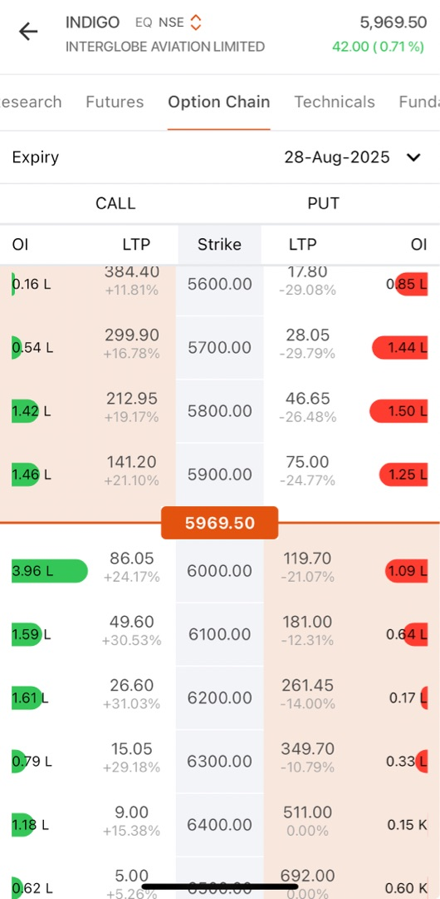|  | 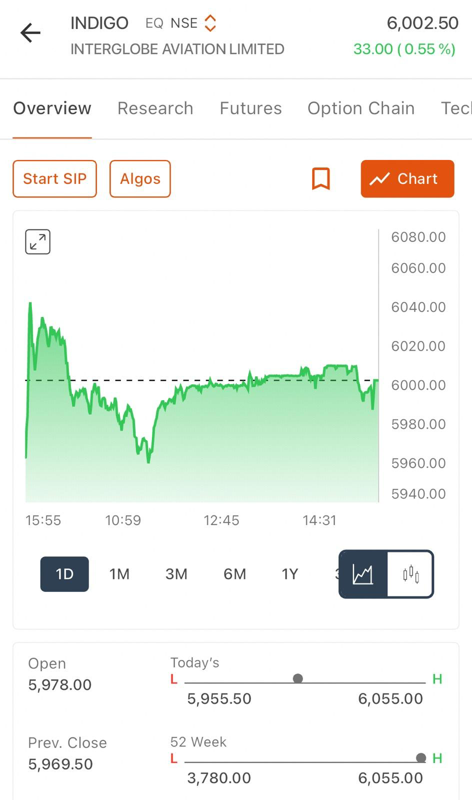 |

#### Strike Analysis From Option Chain Data
- INDIGO Spot Price: ₹5,969.50
- 5900 Call: ₹141.20 (ITM with significant premium)
- 6000 Call: ₹86.05 (ATM - optimal choice) ← Primary focus
- 6100 Call: ₹49.60 (OTM requiring substantial movement)

#### Strategic Reasoning for 6000 Call Selection
- Stock price at ₹5,969.50 positions 6000 Call nearly ATM
- Higher delta coefficient compared to OTM alternatives
- Reasonable premium compared to ITM options
- Strong Open Interest (3.96L contracts) ensuring adequate liquidity

#### Decision-Making Process
- Noted the 5900 Call volatility pattern (₹117→₹164→₹141.20)
- Avoided chasing momentum after significant price swings
- Selected 6000 Call as cleaner, more structured setup
- Waited for stock trend confirmation before entry

#### Risk-Reward Mathematics
- 6000 Call requires only ₹30.50 stock movement to achieve ITM status
- Significantly more achievable target than 6100+ strikes
- Premium cost of ₹86 provides reasonable risk versus ₹141 for 5900 Call

**Learning:** Acting on the decision takes _huge patience_ and _ability to leave the trade_ if the right entry zone is missed. The case study demonstates instinctively chosing the optimal strike - avoiding expensive ITM options while rejecting high-risk deep OTM positions.

***

## 3. Use Open Interest (OI) and Liquidity to Confirm Key Strikes

### The Power of Open Interest Analysis
Strong OI concentration within option chains signals market consensus regarding important support and resistance levels. Trading around OI clusters provides several advantages:

- **Enhanced Liquidity:** Easier position entry and exit execution
- **Price Level Significance:** High OI strikes often represent psychological or institutional interest zones
- **Market Direction Clues:** OI distribution reveals where major market participants position themselves

Avoid strikes displaying thin or evenly distributed OI patterns. Such strikes offer limited market insight and may suffer from wider bid-ask spreads.

### Open Interest as Smart Money Indicator
Open Interest reveals where sophisticated market participants concentrate their positions and where most contracts accumulate.
- **High OI Strikes:** Indicate areas where significant trading volume consolidates
- **OI Walls:** Often function as support/resistance levels or "option magnet" zones, influencing price behavior approaching expiration

### Implementation Steps
- **Identify OI Surges:** Look for strikes showing unusual OI accumulation or protective "walls"
- **Avoid Thin OI Strikes:** Skip obscure strikes with poor liquidity exhibiting wider spreads and limited market participation

**Example:** If call options cluster heavily around 1500 strike for a stock trading near 1480, this strike likely represents significant resistance. This makes it a logical reference point for trading decisions or technical analysis.

**Actionable Tip:** Base trading decisions near OI concentration zones for improved liquidity, better exit opportunities, and enhanced technical reaction levels.

### Case Study: Britannia Option Chain - Diffuse OI Pattern
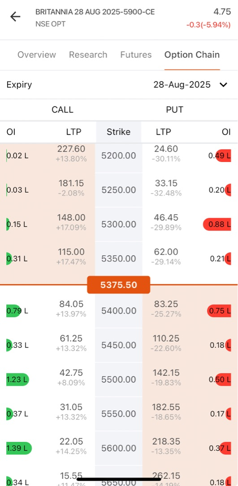

#### Analyzing Britannia Option Chain (28-Aug-2025 Expiry)
- Spot Price: ₹5,375.50
- Call Strike Analysis Around Current Level:

<table>
    <tr>
        <th><b>OI pattern analysis</b></th>
        <th></th>
        <th><b>Observations</b></th>
    </tr>
    <tr>
        <td>
            <li>5600 Call: 1.39L OI</li>
            <li>5550 Call: 0.37L OI</li>
            <li>5500 Call: 1.23L OI</li>
            <li>5450 Call: 0.33L OI</li>
            <li>5400 Call: 0.79L OI</li>
        </td>
        <td>
        </td>
        <td>
            <li>OI is scattered across different strikes</li>
            <li>No obvious concentration or "wall"</li>
            <li>Highest OI (1.39L) is far OTM at 5600</li>
            <li>No clear market consensus on direction</li>
        </td>
    </tr>
</table>

#### Decision making
- **No Favorable Trade Opportunity:** Scattered OI pattern provides no statistical edge
- **Market Indecision:** Diffuse OI distribution suggests lack of strong directional conviction
- **Wait for Clarity:** Better to preserve capital until clearer market signals emerge

**Learning:** When no clear statistical advantage exists, the optimal strategy involves avoiding forced trades and waiting for higher-probability setups.

***

## 4. Avoid Chasing Big Same-Day Premium Jumps (>15%)

### Understanding Premium Spike Dynamics
Options exhibiting sharp premium increases within single trading sessions often reflect sudden buying surges or volatility explosions. Purchasing after such dramatic moves typically means:

- **Overpaying Premium:** Paying significantly higher prices than original position holders
- **Reversal Risk:** Greater exposure to premium pullbacks if momentum dissipates
- **Poor Risk-Reward:** Entering at inflated levels reduces profit potential

**Optimal Strategy:** Wait for premium retracement or minor corrections following major spikes before considering entry.

### The Mathematics of Premium Spikes
When option premiums surge 15-50% within single sessions, the "easy profit" phase usually concludes:
- **News-Driven Spikes:** Market catalysts or volatility explosions cause rapid premium expansion
- **Late Entry Penalty:** Buying after major moves creates exposure to sharp premium contractions during reversals

**Example:** If a call option advances from ₹20 to ₹23 (+15%) during one session, avoid purchasing at ₹23. Instead, wait for pullback toward ₹19-20 levels if the underlying trend remains intact.

This discipline maintains superior risk-reward ratios while avoiding inflated entry prices.

**Example:** Reliance 2500CE rises from ₹25 to ₹32 (+28%) by midday. Entering at current levels means accepting "late entry" status with elevated reversal risk exposure.

**Actionable Tip:** Wait for retracement opportunities or minor corrections before entering, unless possessing precise confirmation signals (breakout + volume + favorable broad market trend).

### Case study: HDFC Life 790 Call - 52.63% Premium Jump
| HDFC Life Option Chain Above StockPrice | HDFC Life Option Chain Above StockPrice | HDFC Life Stock Price |
| :-- | :-- | :-- |
|| 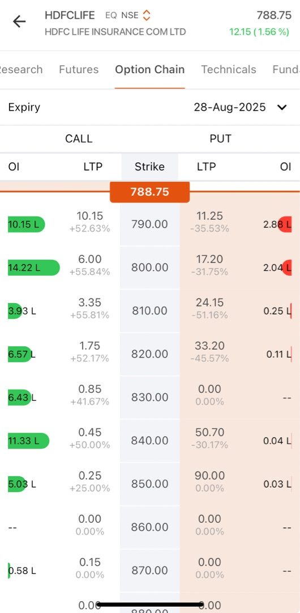 | 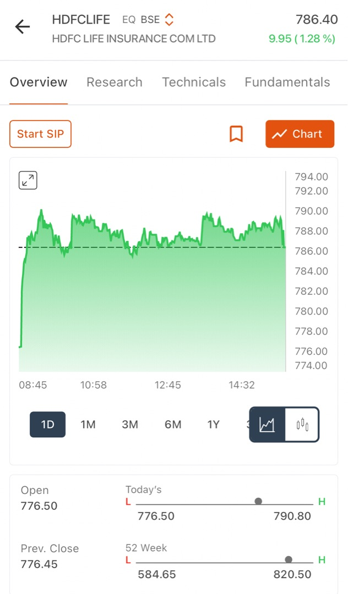 |

#### Premium Spike Analysis From Option Chain
- **HDFC Life spot:** ₹788.75
- **790 Call LTP:** ₹10.15
- **Premium change:** +52.63% ← significant red flag!

####  Detailed Option Price Movement Analysis
- **Previous Close:** ₹6.65 (baseline reference)
- **Intraday High:** ₹12.65 (peak spike level)
- **Current Level:** ₹10.15 (post-spike consolidation)
- **Total Movement:** Represents massive intraday volatility expansion

#### Apply the rule
- **52.63% > 15% Threshold:** Clear signal to _avoid chasing_ momentum
- **Optimal Entry Zone:** Pullback toward ₹8.0-₹9.2 range would improve risk-reward
- **Strategic Patience:** Analysis correctly suggested waiting for premium corrections

#### Why This Approach Proves Correct
- **Stock Position:** ₹788.75 places it extremely close to 790 strike
- **Premium Inflation:** Already elevated due to proximity and volatility expansion
- **Risk Management:** Waiting for pullbacks significantly improves risk-reward mathematics

**Learning:** Instinctively avoiding 52% premium spike demonstrates sound trading discipline and risk management principles.

***

## 5. Enter on Pullbacks, Not at Session Highs

### Strategic Entry Timing
Optimal entry prices for option premiums typically occur within the lower third to middle range of previous day's trading range, or during retests of established intraday support levels.
- **Avoid Peak Prices:** Purchasing at previous day's premium highs often represents "momentum chasing" behavior
- **Target Retracements:** Use 25-40% pullbacks from previous session's high-to-low range as potential entry opportunities

### The Psychology of Pullback Entries
Entering during pullbacks after rapid moves improves both risk-reward mathematics and holding capacity through market noise:
- **Price Discovery:** Identify lower third to middle portions of prior session's premium range
- **Technical Confluence:** Combine pullback levels with intraday support zone analysis

**Example:** A call option trades between ₹8-₹12 during previous session, closing at ₹10. Optimal entry occurs around ₹8.5-₹9.5 levels to optimize risk parameters.

This disciplined approach captures momentum opportunities while managing premium overpayment risks.

**Example:** Option trades from ₹8 to ₹12.5 during current session, closes at ₹10.4. Perfect entry zone = ₹8.8-₹9.5 during next morning session, avoiding ₹12+ momentum highs.

**Actionable Tip:** Utilize previous range analysis and option chart support identification to "buy pullbacks" instead of chasing momentum at peak levels.

#### Advanced Entry Timing Techniques
##### Premium Range Analysis:

- Calculate previous session's premium range (High - Low)
- Identify 25% and 50% retracement levels
- Wait for price to test these mathematical support levels
- Confirm with volume and underlying stock momentum

##### Support Level Integration:

- Overlay technical support from stock charts
- Identify previous premium support zones
- Look for confluence between mathematical and technical levels
- Enter when both align with favorable risk-reward

##### Example Calculation:
Previous session range: ₹8.00 (Low) to ₹12.50 (High)

- Range = ₹4.50
- 25% retracement from high = ₹12.50 - (0.25 × ₹4.50) = ₹11.38
- 50% retracement from high = ₹12.50 - (0.50 × ₹4.50) = ₹10.25
- Optimal entry zone: ₹10.25 - ₹11.38

***

## 6. Set Stop Loss at 25–30% Below Entry on Premium (Or Below Valid Support)

### Risk Control Framework
Risk management forms the cornerstone of sustainable options trading. Establish stop loss levels based on option premium decline rather than solely relying on underlying stock price movements:

- **Premium-Based Stops:** 25-30% below entry premium provides adequate buffer for normal intraday fluctuations while protecting capital
- **Technical Alternative:** Place stops just below nearest technical support levels on option's price chart

### Stop Loss as Capital Preservation
Options experience rapid value decay through time and volatility changes.
- **Mathematical Protection:** Setting stops at 25-30% below entry premium guards against slow erosion or rapid reversals
- **Dynamic Adjustment:** Tighten stops when entering late or after significant moves (reduce to 20-25%)

**Example:** Enter call option at ₹10 premium; establish stop loss around ₹7.0-₹7.5 levels. 
Risk-Adjusted Example: Late entry near daily highs requires tighter stops around 20-25% levels for improved risk management.

**Example:** 800CE bought at ₹16; stop loss = ₹12 (25% cut) or at the lowest nearby premium support on its intraday chart.

**Actionable Tip:** Think in terms of premium risk exposure rather than focusing exclusively on underlying stock movement patterns.

#### Advanced Stop Loss Techniques
##### Premium-Based Calculation:
- Entry Price: ₹10.00
- 25% Stop: ₹10.00 × 0.75 = ₹7.50
- 30% Stop: ₹10.00 × 0.70 = ₹7.00
- Choose based on entry timing and market volatility

##### Technical Support Method:

- Identify previous premium low points
- Draw support trend lines on option chart
- Place stop 5-10% below key support levels
- Combine with premium percentage method for confirmation

##### Market Context Adjustments:

- High Volatility: Use wider stops (30%) to avoid premature exits
- Low Volatility: Tighten stops (20-25%) to preserve capital
- Late Entry: Always use tighter stops regardless of volatility
- Early Entry: Can afford standard 25-30% stops

***

## 7. Set Profit Target at 33–50% Above Entry on Premium
### Realistic Profit-Taking Strategy
Systematic profit-taking preserves gains before options lose value through time decay (θ) or volatility contraction. Establishing clear targets prevents the common mistake of holding too long.
- **Minimum Target:** Aim for at least 33% gain on premium investment
- **Scaling Strategy:** Partial profit booking at lower end (33%) locks gains while allowing remainder to capture additional upside
- **Maximum Target:** Full position exits around 50% premium gains for most trades

### Book Profits Before Decay Eats Up Gains
- Don’t wait forever for “big moves”. Take profits in tranches at +33% and near +50% from your entry.
- Hold a small “runner” if trend stays powerful, else exit fully.

### The Mathematics of Option Profit Taking
Options premiums rarely trend in straight lines due to multiple variables affecting pricing:
- **Time Decay:** θ constantly erodes option value
- **Volatility Changes:** Implied volatility expansion/contraction affects premiums
- **Delta Changes:** As options move ITM/OTM, their sensitivity changes

**Strategic Framework:** Take profits in tranches at +33% and approaching +50% from entry levels. Maintain small "runner" position if trend shows exceptional strength, otherwise exit completely.

**Calculation Example:**
- Entry Premium: ₹10.00
- T1 (33% target): ₹10.00 × 1.33 = ₹13.30
- T2 (50% target): ₹10.00 × 1.50 = ₹15.00

Profit targets should align with expected underlying price movements and key technical resistance levels.

**Market Application:** Entry at ₹10 premium, T1 = ₹13.3 (book 50% of position), T2 = ₹15 (exit remainder). If downtrend develops, book entire position. If uptrend continues, maintain partial position with trailing stop loss.

**Learning:** Greed receives punishment in options trading. Bank gains proactively, especially with short-dated contracts where time decay accelerates.

#### Advanced Profit-Taking Strategies
##### Scaling Out Method:
- **33% Target:** Exit 50% of position
- **45% Target:** Exit additional 30% of position
- **60% Target:** Exit final 20% of position
- This preserves capital while allowing upside participation

##### Trend-Based Adjustments:
- **Strong Trend:** Hold for higher targets (50-75%)
- **Weak Trend:** Take profits quickly (25-35%)
- **Choppy Market:** Book at first profitable opportunity

##### Time-Based Considerations:
- **Weekly Options: Take profits faster (25-40%)
- **Monthly Options: Can hold for higher targets (40-60%)
- **Quarterly Options: Allow more room for development (50-75%)

***

## 8. Avoid Overloading Positions with Too Much Correlation

### Understanding Portfolio Correlation Risk
Taking multiple trades that move simultaneously due to shared sector, index, or directional dependencies concentrates risk exposure. Multiple positions winning or losing together from identical underlying factors eliminates diversification benefits.

**Risk Mitigation:** Diversify across different sectors, option types, or market directions to smooth portfolio return patterns and reduce single-point failure risks.

### Correlation as Hidden Risk Multiplier
Several positions tied to identical sectors, indices, or directional movements can create catastrophic loss scenarios:
- **Sector Concentration:** Multiple banking stock calls suffer simultaneous losses during financial sector corrections
- **Directional Bias:** All bullish positions face coordinated losses during market reversals
- **Index Correlation:** Positions moving with same index experience synchronized volatility

**Example:** Purchasing calls on five banking stocks creates vulnerability to banking sector shocks. Improved approach involves mixing with technology, pharmaceutical, or commodity sectors while potentially including bearish positions for balance.

**Example:** All call positions in IT stocks create exposure where sudden technology sell-off impacts all trades simultaneously. Better portfolio construction mixes sectors, indices, and includes some bearish trades (puts) for offset protection.

**Actionable Tip:** Mix positions across unrelated sectors or include opposite-direction trades (puts alongside calls) to offset concentrated exposures. Regularly evaluate active trades - would single news event eliminate multiple positions? If yes, rebalance toward reduced correlation.

#### Advanced Correlation Management
##### Sector Diversification Matrix
- Maximum 30% in any single sector
- Include defensive sectors (FMCG, Pharma) with cyclical sectors (Auto, Banking)
- Balance growth sectors (Technology) with value sectors (Energy, Utilities)

##### Directional Balance
- Avoid all bullish or all bearish positions
- Include some hedging positions
- Consider neutral strategies (straddles, strangles) during uncertainty

##### Index Correlation Awareness
- NIFTY-heavy stocks move together during market moves
- Include NIFTY alternatives (mid-cap, small-cap, sectoral indices)
- Consider international exposure if available

##### Position Sizing by Correlation
- **Highly correlated positions:** Smaller individual sizes
- **Uncorrelated positions:** Can use standard position sizes
- **Negatively correlated positions:** Can use larger combined sizes

***

## 9. Hedge When Market Direction Is Uncertain or Volatile
### Protective Hedging Strategy
Protective hedging through opposite-side options (puts alongside calls) limits downside risk during choppy market conditions. This approach keeps losses defined while maintaining manageable position sizes during uncertain periods.

#### Hedging as Portfolio Insurance
Purchasing opposite-side options functions as portfolio insurance:
- **Protective Puts:** Guard long call positions against adverse moves
- **Protective Calls:** Protect short put positions during unexpected rallies
- **Trade-off:** Sacrifices some upside potential but prevents catastrophic losses

**Example:** Hold bullish 310 call position and purchase 305 put as insurance to cap potential losses around ₹5,000 total exposure.

While hedging reduces potential gains, it provides prudent risk management for volatile periods or major events.

**Actionable Tip:** For major events or when experiencing uncertainty, pair options to define risk parameters and improve sleep quality. If adverse results occur, total loss remains capped at predetermined level.

### Case study: ETERNAL Position - Advanced Premium-Based Risk Management
| Eternal Option Chain | Eternal StockPrice | Eternal Option 310CE |
| :-- | :-- | :-- |
|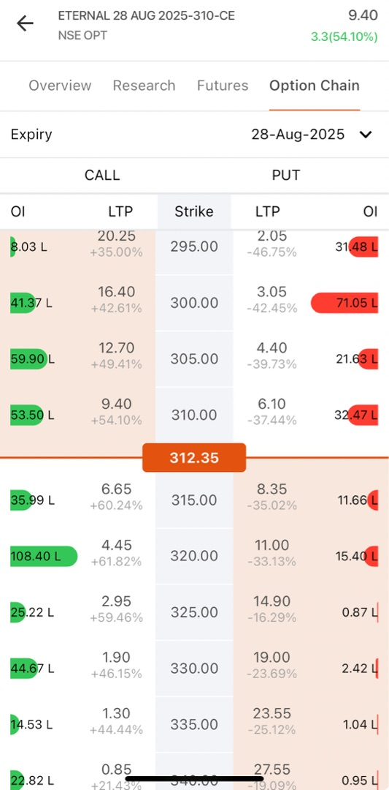| 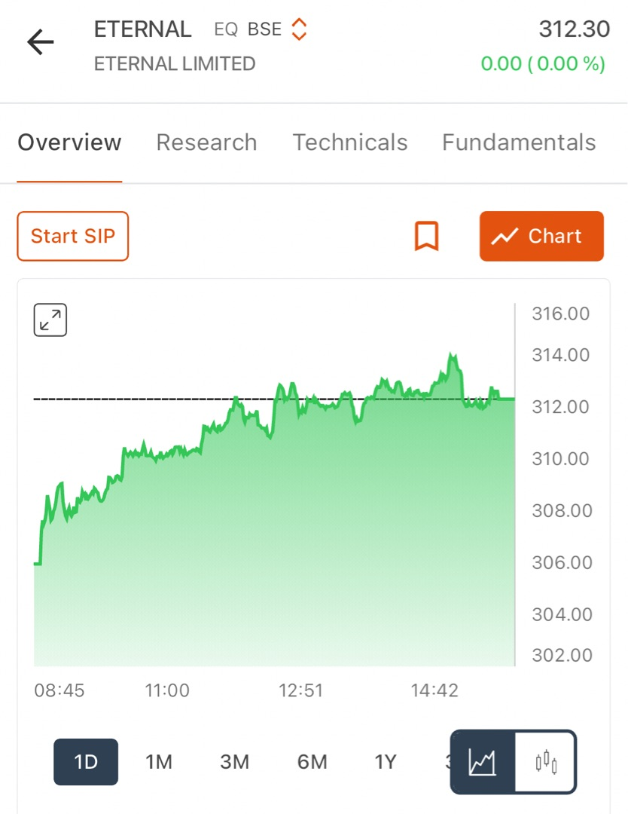 | 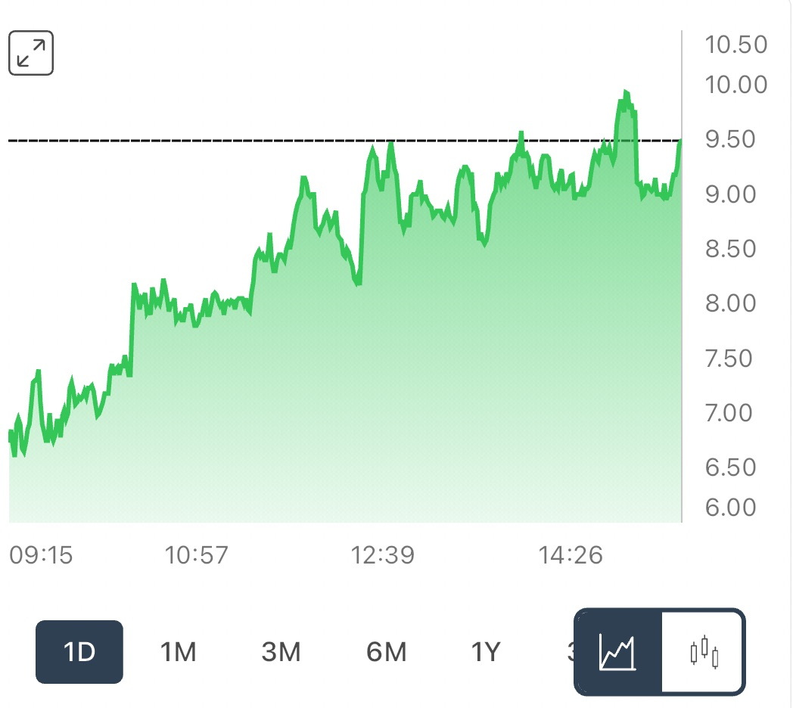 |

#### Sophisticated Position Construction
- **310 Call Entry:** ₹9.6 premium
- **305 Put Hedge:** ₹5.8 premium
- **Total Investment:** ₹15.4 per share
- **Risk Management Goal:** Cap total loss at ₹5,000

#### Advanced Stop Loss Methodology
- **Individual Option Stops:** Not simply 25-30% of each premium
- **Combined Position Stop:** Triggered when total portfolio loss approaches ₹5,000 limit
- **Sophisticated Thinking:** This demonstrated advanced risk management beyond basic rules

#### Dynamic Profit Management Approach
- **Dual Monitoring:** Both legs tracked simultaneously
- **Scenario Planning:** Ready to exit put on stock strength, hold call for targets
- **Reverse Scenario:** Prepared to exit call if stock weakened, potentially maintain put
- **Advanced Technique:** Dynamic management based on changing market conditions

#### Professional Outcomes
- **Premium-Based Stops:** Proved more effective than stock-based stop methods
- **Hedging Impact:** Completely changes risk calculation mathematics
- **Portfolio Management:** Total loss management supersedes individual option stops
- **Integrated Application:** Rules 6, 7, and 9 applied simultaneously in sophisticated hedge strategy

This case study demonstrates professional-level application of multiple rules in complex position management.

***

## 10. Skip Trades Without Clear Statistical Edge
### The Power of Patience
If option chains display evenly distributed open interest, mixed technical signals, or unclear trend patterns, superior strategy involves sitting out completely. Patience protects capital while preserving resources for higher-probability trading opportunities.

### "No Edge, No Trade" Philosophy
Professional traders understand that "No Edge, No Trade" wisdom surpasses random speculation:
- **Diffuse OI:** Scattered open interest across strikes indicates market indecision
- **Confused Charts:** Mixed technical signals provide no directional clarity
- **Capital Preservation:** Waiting mode protects resources for better opportunities

**Example:** When option chains like Britannia display diffuse OI distribution across multiple strikes without concentration, this signals absent consensus. Best practice involves waiting for clearer market direction.

**Actionable Tip:** Primary trading edge comes from patience. Only risk capital when understanding why probability odds favor your position.

### Case study: Britannia Analysis - Perfect Rule Application

#### Professional Market Assessment
- **Observation:** "Open interest for calls quite spread out and similarly for puts as well"
- **No Concentration:** Absence of significant OI clustering at any specific strike
- **Missing Signals:** No obvious support/resistance levels indicated by market positioning

#### Professional Decision
- **Conclusion:** "No favorable trade possible" is textbook implementation of this rule
- **Discipline:** Resisted temptation to force trading opportunity where none existed

#### Analysis Excellence
- **Comprehensive Review:** Examined both calls and puts OI distributions
- **FOMO Resistance:** Did not allow fear of missing out to drive poor decisions
- **Market Reading:** Correctly interpreted scattered OI as market uncertainty
- **Professional Choice:** Selected capital preservation over speculation

#### Professional trader behavior
- **Amateur Mistake:** Many beginners would force trades anyway
- **Professional Discipline:** Demonstrated patience to sit out when no statistical edge exists
- **Success Differentiation:** This patience separates successful traders from gamblers
- **Learning Achievement:** Perfect application of "no edge, no trade" principle - hallmark of professional trading approach

***

## 11. Monitor Both Stock and Option Charts for Trend Confirmation
### Dual Chart Analysis Framework
Options prices reflect three primary components: underlying stock movement, implied volatility changes, and supply-demand dynamics. Confirm trend alignment on both spot and option price charts before position entry.

#### Confirmation Signals:
- **Bullish Alignment:** Rising stock + increasing call premium volume indicates genuine strength
- **Bearish Alignment:** Declining stock + rising put premiums reflects authentic downside conviction

Utilize option chart patterns and volume analysis to gauge demand and momentum alongside underlying stock technical analysis.

### Double Confirmation Strategy
Spot and option charts should demonstrate agreement for high-confidence trades:
- **Synchronized Moves:** Rising stock with surging call premium plus volume confirms direction and momentum
- **Divergence Warnings:** Rising stock with flat call premium suggests time decay or implied volatility decline issues

**Example:** Stock rallies strongly while call premium also surges with significant volume indicates green light for continuation. However, if stock moves higher while call premium remains flat, investigate time decay or IV contraction causes.

**Actionable Tip:** Overlay option and underlying charts within trading platform. Look for synchronized movements before and during trade execution.

### Case study: DMART Stock and Option Premium Alignment
| DMART Option Chain | DMART Option4300CE | DMART Stock Price |
| :-- | :-- | :-- |
|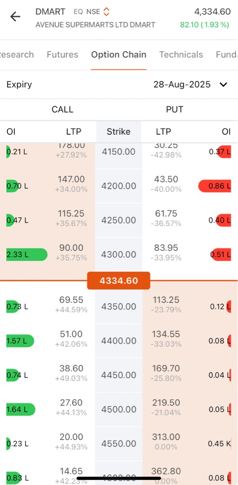| 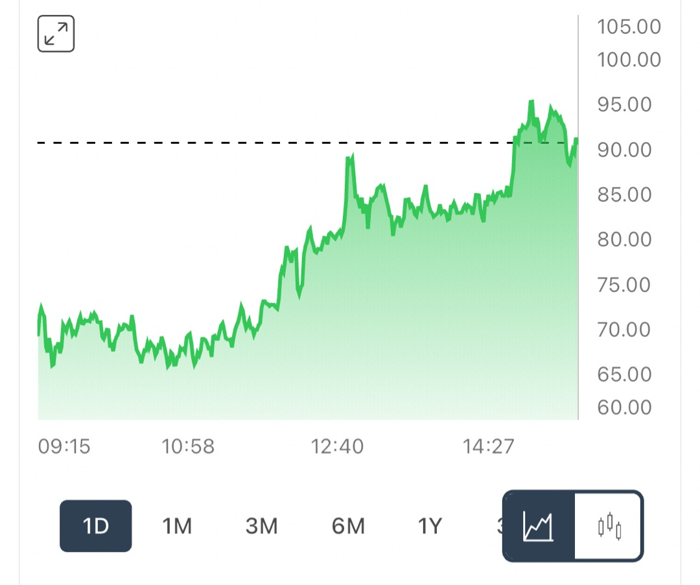 | 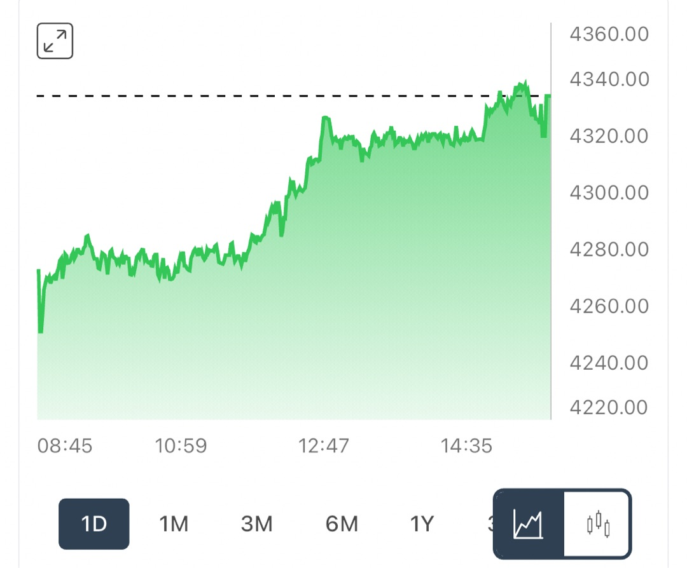 |

##### Comprehensive Stock Chart Analysis
- **DMART Trend:** Clear uptrend maintained throughout trading session
- **Price Movement:** Advanced from approximately ₹4,280 to ₹4,340 levels
- **Buying Pressure:** Consistent accumulation with closing near session highs
- **Volume Confirmation:** Adequate volume supported the entire price advance

##### Option Chart Confirmation Analysis
- **4300 Call Premium:** Moved from lower levels to ₹90+ range
- **Chart Pattern:** Displayed steady rise with minor dips being purchased
- **Volume Support:** Options volume also increased during premium advance
- **Trend Synchronization:** Premium trend perfectly matched underlying stock trend

##### Professional Analysis Approach
- **Dual Chart Study:** Analyzed both charts together for confluence
- **Alignment Recognition:** Noted perfect synchronization between stock strength and premium expansion
- **Entry Confirmation:** Waited for this dual confirmation before considering position entry
- **Risk Reduction:** Understood this confirmation significantly reduced probability of false signals

##### Market Confirmation Validation
- **Genuine Demand:** Real buying interest evident in both stock and options markets
- **Sustained Move:** Not merely technical bounce but authentic demand continuation
- **Market Agreement:** Options market consensus aligned with stock direction
- **Higher Probability:** Setup indicated elevated probability for trend continuation

**Learning:** Natural application of Rule 11 through confirming both stock and option trends before making trading decisions demonstrates advanced market analysis skills.

#### Advanced Confirmation Techniques
##### Volume Analysis Integration
- Compare stock volume with historical averages
- Analyze option volume relative to open interest
- Look for volume spikes during breakouts
- Confirm volume supports price direction

##### Time Frame Alignment
- Check multiple time frames (5min, 15min, hourly)
- Ensure trend consistency across time frames
- Look for higher highs and higher lows
- Confirm support/resistance levels hold

##### Volatility Consideration
- Monitor implied volatility changes
- Rising IV supports premium expansion
- Falling IV can hurt premiums despite stock moves
- Consider volatility environment in decisions

***

# Summary Table
| Rule # | Core Principle | Detailed Example | Key Learning |
|:--|:--|:--|:--|
| 1 | Classify Moneyness (ITM/ATM/OTM) | Stock ₹100 → 95C ITM (₹5 intrinsic), 100C ATM (max time value), 105C OTM (pure speculation) | Moneyness determines cost structure and probability |
| 2 | Prefer ATM/Slightly ITM Strikes | Stock ₹200 → Choose 200C (50-60% Δ) or 205C over 210C (requires 5% move) | Higher delta provides better price correlation |
| 3 | Use OI for Strike Confirmation | Calls clustered at 1500 strike indicate resistance; scattered OI like Britannia = no edge | OI concentration reveals market consensus |
| 4 | Avoid >15% Premium Jumps | Call moves ₹20→₹23 (+15%) → Wait for pullback to ₹19-20 range | Late entry reduces risk-reward ratio |
| 5 | Enter on Pullbacks, Not Highs | Option range ₹8-₹12 → Target entry ₹8.5-₹9.5, avoid ₹12 peaks | Pullback entries improve risk-reward mathematics |
| 6 | Stop Loss 25-30% Premium Drop | Entry ₹10 → SL ₹7.0-₹7.5 (adjust tighter for late entries) | Premium-based stops more effective than stock-based |
| 7 | Profit Target 33-50% Premium Gain | Entry ₹10 → T1 ₹13.3 (book partial), T2 ₹15.0 (exit remainder) | Scale out to lock gains before decay |
| 8 | Avoid High Correlation Positions | Don't hold 5 banking calls simultaneously; diversify across sectors | Single event can eliminate correlated positions |
| 9 | Hedge During Uncertainty | 310C + 305P hedge caps loss at ₹5,000 total exposure | Insurance reduces catastrophic loss risk |
| 10 | Skip Trades Without Clear Edge | Britannia scattered OI → No favorable trade opportunity exists | Patience preserves capital for better setups |
| 11 | Confirm Stock and Option Trends | DMART: Stock ₹4,280→₹4,340 + 4300C premium ₹90+ with volume | Dual confirmation reduces false signal probability |

***

## Advanced Risk Management Principles

### Position Sizing Framework

Proper position sizing forms the foundation of sustainable options trading. Never risk more than predetermined percentages of total capital on any single trade:

**Conservative Approach (Recommended for Beginners):**
- Maximum 2-3% of total capital per trade
- Maximum 10-15% of capital in options positions simultaneously  
- Scale position sizes based on conviction levels

**Moderate Risk Approach:**
- Maximum 3-5% of total capital per trade
- Maximum 20-25% of capital in options positions
- Larger sizes only for highest conviction setups

**Position Sizing Calculation Example:**
- Total Capital: ₹100,000
- Conservative Trade Size: ₹2,000-₹3,000 per position
- Maximum Options Exposure: ₹10,000-₹15,000 total

### Time Decay Management

Understanding theta (θ) decay becomes crucial for options success:

**Time Decay Acceleration:**
- Options lose value faster as expiration approaches
- Weekly options experience rapid decay (avoid unless very short-term trades)
- Monthly options provide better time cushion for position development

**Practical Time Management:**
- Exit positions with 7-10 days to expiration regardless of profit/loss
- Avoid holding weekend positions in weekly options
- Consider rolling positions to next expiration if thesis remains intact

### Volatility Environment Awareness

Implied Volatility (IV) significantly impacts option premiums:

**High IV Environment:**
- Options expensive relative to historical norms
- Consider selling premium strategies
- Expect volatility contraction to hurt long positions

**Low IV Environment:**  
- Options relatively cheap
- Favorable for buying premium strategies
- Volatility expansion can significantly boost returns

**IV Percentile Assessment:**
- Compare current IV to 52-week range
- IV Percentile > 80% = Expensive options
- IV Percentile < 20% = Cheap options
- Trade accordingly with environment

### Earnings and Event Trading

Special considerations apply around major events:

**Earnings Season Strategy:**
- Implied volatility typically elevated before announcements
- "Volatility crush" commonly occurs post-earnings
- Consider shorter-dated positions or hedged strategies
- Exit before announcement if capturing IV expansion

**Event Risk Management:**
- Reduce position sizes around major events
- Consider calendar spreads to benefit from volatility changes
- Avoid naked long positions in high-event-risk periods

### Market Regime Adaptation

Different market environments require strategy adjustments:

**Trending Markets:**
- Directional strategies work well
- Momentum-based entries effective
- Trailing stops capture extended moves

**Range-Bound Markets:**
- Mean reversion strategies preferred
- Sell premium at range extremes  
- Quick profit-taking becomes essential

**High Volatility Markets:**
- Reduce position sizes
- Use wider stops to avoid whipsaws
- Consider volatility-selling strategies

**Low Volatility Markets:**
- Increase position sizes moderately
- Buy premium strategies favored
- Prepare for volatility expansion

***

## Common Psychological Pitfalls and Solutions

### Overconfidence After Wins

**Problem:** Series of winning trades leads to increased position sizes and reduced discipline.

**Solution:** 
- Maintain consistent position sizing regardless of recent performance
- Follow systematic rules even during winning streaks
- Document what worked to repeat success systematically

### Revenge Trading After Losses

**Problem:** Large losses trigger emotional attempts to "win back" money quickly.

**Solution:**
- Take mandatory breaks after significant losses
- Reduce position sizes until confidence returns
- Focus on process improvement rather than profit recovery

### Analysis Paralysis

**Problem:** Over-analyzing trades leads to missed opportunities or late entries.

**Solution:**
- Create simple decision trees for common situations
- Set time limits for trade analysis
- Accept that no trade is perfect; focus on probability edges

### Fear of Missing Out (FOMO)

**Problem:** Seeing others' profits leads to impulsive, poorly-timed entries.

**Solution:**
- Maintain personal trading journal to track your specific edge
- Focus on your systematic approach rather than others' results
- Remember that markets provide continuous opportunities

### Confirmation Bias

**Problem:** Seeking information that confirms existing positions while ignoring contrary evidence.

**Solution:**
- Actively seek opposing viewpoints before trades
- Set up alerts for contrary indicators
- Practice "devil's advocate" analysis for each position

***

## Technology and Tools Integration

### Essential Trading Platform Features

**Options Chain Analysis:**
- Real-time Greeks display (Delta, Gamma, Theta, Vega)
- Open Interest and Volume data
- Strike-wise P&L visualization
- Multiple expiration viewing

**Charting Capabilities:**
- Both stock and option price charts
- Volume integration
- Technical indicator support
- Multiple timeframe analysis

**Risk Management Tools:**
- Position sizing calculators
- Portfolio-level Greeks
- Maximum loss scenarios
- Margin requirement displays

### Recommended Analysis Workflow

**Pre-Market Preparation:**
1. Review overnight news and market futures
2. Identify potential trading candidates
3. Analyze option chains for opportunities
4. Set price alerts for entry levels

**Market Hours Execution:**
1. Monitor pre-defined entry levels
2. Confirm technical and options alignment
3. Execute trades with predetermined size and stops
4. Track position development continuously

**Post-Market Review:**
1. Analyze executed trades for learning opportunities
2. Review positions for next-day management
3. Update trading journal with observations
4. Plan next-day strategy adjustments

### Mobile Trading Considerations

**Advantages:**
- Quick trade execution capabilities
- Real-time market monitoring
- Price alert notifications
- Position tracking convenience

**Limitations:**
- Reduced chart analysis capabilities
- Limited options chain functionality
- Higher execution error probability
- Emotional trading tendency increases

**Best Practices:**
- Use mobile for execution only after desktop analysis
- Set up comprehensive alerts to minimize screen time
- Practice mobile platform extensively before live trading
- Maintain strict discipline rules for mobile trades

***

## Building Long-Term Trading Success

### Continuous Learning Framework

**Market Education:**
- Study historical market cycles and option behavior
- Understand macroeconomic factors affecting volatility
- Learn from experienced traders through books and courses
- Practice paper trading before risking capital

**Performance Analysis:**
- Track all trades in detailed spreadsheet or journal
- Calculate risk-adjusted returns regularly
- Identify patterns in winning and losing trades
- Adjust strategies based on statistical evidence

### Capital Growth Strategy

**Conservative Growth Path:**
- Start with small position sizes to learn market behavior
- Focus on consistent small wins rather than home runs
- Gradually increase size as competence develops
- Maintain strict risk management throughout scaling

**Compound Growth Mathematics:**
- 2% weekly gains compound to 180% annually
- Consistency matters more than spectacular wins
- Risk management preserves capital for compounding
- Small edge applied consistently generates significant returns

### Professional Development Milestones

**Beginner Phase (0-6 months):**
- Master basic options mechanics
- Implement systematic rules consistently
- Focus on capital preservation over profits
- Develop emotional discipline

**Intermediate Phase (6-18 months):**
- Refine strategy based on performance data
- Begin exploring advanced strategies
- Increase position sizes gradually
- Develop market timing skills

**Advanced Phase (18+ months):**
- Create personal trading systems
- Consider teaching or mentoring others
- Explore institutional-quality strategies
- Build sustainable trading business

***

## Conclusion

Mastering options trading requires transforming from emotional speculation to systematic, disciplined execution. These 11 rules provide a comprehensive framework built on practical experience and mathematical probability.

**Core Success Principles:**
- **Patience:** Wait for high-probability setups rather than forcing trades
- **Discipline:** Follow systematic rules consistently regardless of emotions  
- **Risk Management:** Preserve capital above all other considerations
- **Continuous Learning:** Adapt and improve based on market feedback

The patient, disciplined trader not only survives market adversity but thrives through consistent application of proven principles. These rules serve as a roadmap toward confident, systematic options trading that transforms gambling instincts into professional trading discipline.

**Final Implementation Strategy:**
1. Start with paper trading to practice rule application
2. Begin with conservative position sizes when trading live
3. Document every trade for pattern recognition
4. Adjust strategies based on statistical performance data
5. Scale up gradually as competence and confidence develop

Success in options trading comes not from predicting market direction perfectly, but from consistently applying probability-based rules that create positive expected value over time. Let discipline be your edge, patience your strength, and systematic execution your path to long-term trading success.

***

Additional principles, pitfalls and support system that I am considering writing about - provided I can observe and share them as case studies are given below:
## Advanced Risk Management Principles
- Position Sizing
- Time Decay Management
- Volatility Environment Awareness
- Earnings and Event Trading
- Market Regime Adaptation

## Common Psychological Pitfalls and Solutions
- Overconfidence After Wins
- Revenge Trading After Losses
- Analysis Paralysis
- Confirmation Bias

## Technology and Tools Integration
- Essential Trading Platform Features
- Recommended Analysis Workflow
- Mobile Trading Considerations

## Building Long-Term Trading Success
- Continuous Learning Framework
- Capital Growth Strategy
- Professional Development Milestones